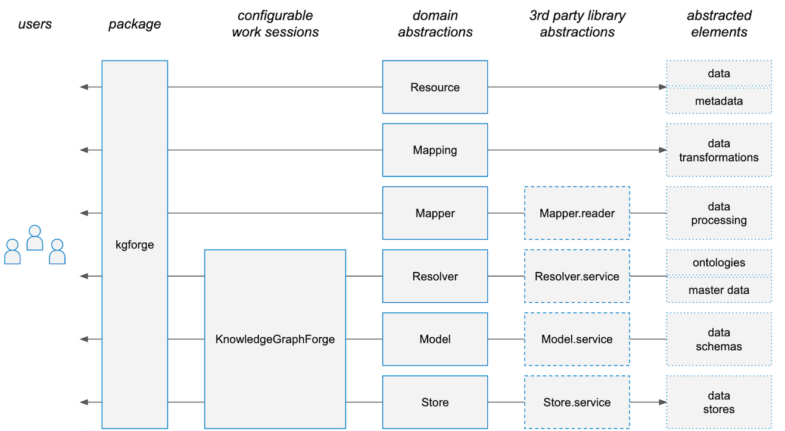

Architecture
============

Philosophy
----------

The architectural design choices for Nexus Forge are to:

#. be generic on where it brings *flexibility* for adaptation to multiple ecosystems,
#. be opinionated on where it simplifies the complexity,
#. have a strong separation of concern with delegation to the lowest level for *modularity*.

Design
------

